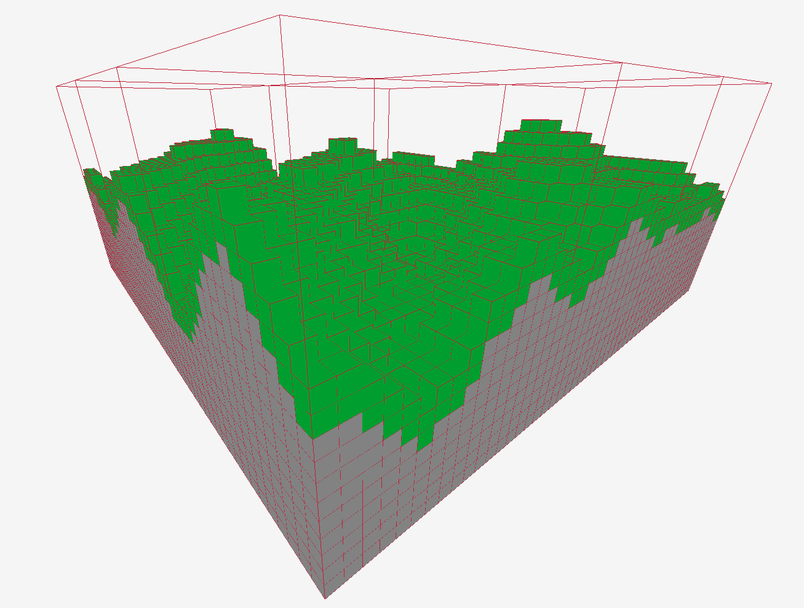
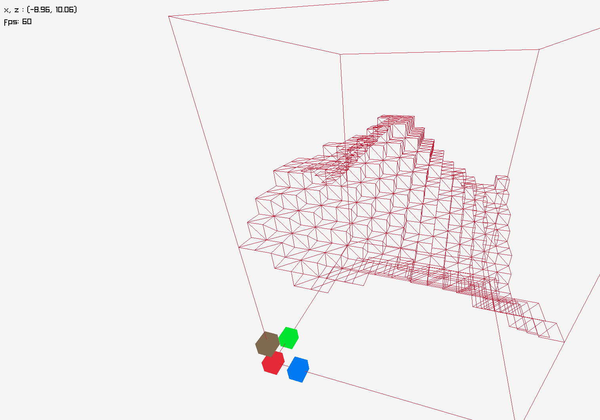

# Blockgame Raylib 
working title 

A simple 3d game similar to Minecraft, with a custom engine written in ReasonML (OCaml) using the Raylib library

Controls: WASD, Left Control to descend, Space to ascend, Esc to quit 

--- 

# Blocked 

I've made good progress with this, but I've run into a blocker. The OCaml bindings for Raylib are built ontop of CTypes, I believe I've run into a situation where the OCaml garbage collecter is cleaning something that has been passed to Raylib's C code, causing a segfault

I'm generating a mesh, the methods expect a C static array and I'm using carray.of_list, this could be a potential cause. Then I upload the mesh to VRAM by pointer, this is where the segfault occurrs and it's quite opaque to me so far 

It's intermittent, sometimes it'll run happily for five minutes, other times it'll crash right away of after 30 seconds or something 

There is also a memory leak of some kind that I haven't figured out 

I have been thinking about getting comfortable with C++ and this has provided some impetus, so I'm moving on for now, though I'd like to solve these issues and come back to this project

---

## Some screenshots 

Drawing cubes to show basic terrain generation 



And the next step, generating a mesh to make it a single draw call, also back-face culling



---

## Setup 

### Linux

https://opam.ocaml.org/doc/Install.html 

Install opam globally on your workstation and run `opam init`, clone the repo

In the project root run the following commands 
```
opam switch create . 5.0.0
eval $(opam env)
opam install . --deps-only

dune build
```
This will create a virtual environment for the current folder using OCaml 5.0, update your PATH for the language version, install dependancies, then run a build to see if it works


To run the game 
```
dune exec blockgame_raylib
```

Or 
```
./_build/default/bin/main.exe
```

### Mac 

Should be exactly the same as above, Raylib does support Metal iirc and should work properly, Rosetta might be required for apple silicon 

### Windows 

I haven't tried this and I wouldn't recommend it 

It might be challenging to install OCaml on a Windows workstation, I wouldn't attempt it right now, I would wait for 1st class support for the latest language versions with the installer

There are instructions from OCaml website https://ocaml.org/docs/installing-ocaml

Note that the Diskuv OCaml (DKML) installer does not yet support OCaml 5.0.0, at time of writing anyway, this codebase should work on OCaml 4.14.0? I haven't tested it 

I will have to work this out eventually for production builds, though it might actually be easier to cross-compile for Windows instead 

## Text Editor 

The only requirement is ocaml-lsp-server, I know this works for Vim and Emacs though I haven't tried it

It's easiest with VSCode or VSCodium with the ocaml-platform plugin, you might need to run `eval $(opam env)` 
and `dune build -w` before opening the editor for the plugin to use the right language version

## Tech choices

#### ReasonML (OCaml)

I have been using Reason to write JavaScript apps for a while, I want to get more comfortable writing native apps and the developer-experience is great. OCaml syntax is still kinda intimidating to me, I'll stick to Reason 

The performance can be near C-like if you need it to be, this way of writing OCaml is what I want to learn, when and how to switch the safety off 

#### Raylib OCaml 

https://github.com/tjammer/raylib-ocaml 

These are simple bindings to the Raylib C library, high-level and easy to use. There are not a lot of options for building games using OCaml, this one is pretty great 

A drawback of this library is that it cannot target wasm, support for compiling OCaml to wasm is in early stages still, and raylib-ocaml is built on CTypes which also presents issues for targeting wasm 

#### Raylib 

https://github.com/raysan5/raylib 

The Library of choice is Raylib, not only because it has OCaml bindings, it's well documented and battle-tested, it can produce builds for a variety of production environments including the browser with wasm 

One drawback is that it's OpenGL and doesn't support Vulcan 

A benefit is that is has diverse build targets 
